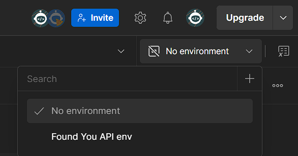

# Step-by-Step Instructions to Run Django Server on Windows

1. **Install Python (if not already installed):**
   - Download Python 3 from [python.org](https://www.python.org/downloads/).
   - After installation, verify by running in Command Prompt or PowerShell:
     ```bash
     python --version
     ```

2. **Set Up a Virtual Environment (Recommended):**
   - In your project directory, create a virtual environment:
     ```bash
     python -m venv venv
     ```
   - Activate the virtual environment:
     - In Command Prompt:
       ```bash
       venv\Scripts\activate
       ```
     - In PowerShell:
       ```bash
       .\venv\Scripts\Activate.ps1
       ```

3. **Install Dependencies:**
   - Install your project dependencies (listed in your `requirements.txt`):
     ```bash
     pip install -r requirements.txt
     ```

4. **Apply Migrations (if needed):**
   - Run migrations to create/update your database schema:
     ```bash
     python manage.py migrate
     ```

5. **Run the Development Server:**
   - Start the Django development server:
     ```bash
     python manage.py runserver
     ```
   - By default, the server will run at `http://127.0.0.1:8000/`.

6. **Link to Postman**
   - https://found-you-restful-api.postman.co/workspace/Found-you-RESTful-API-Workspace~795661ab-c817-4981-8df9-ce6ac9370605/overview
   - Choose environment 
   
   - Before each request script obtaining access token will run so there is no need for manually copy and pasting the token.
